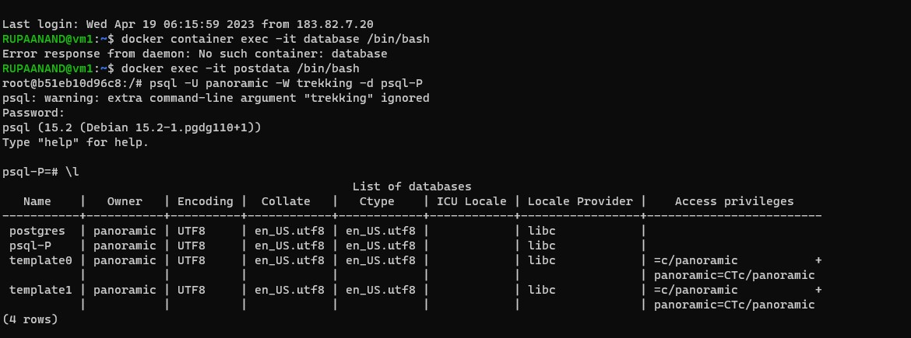
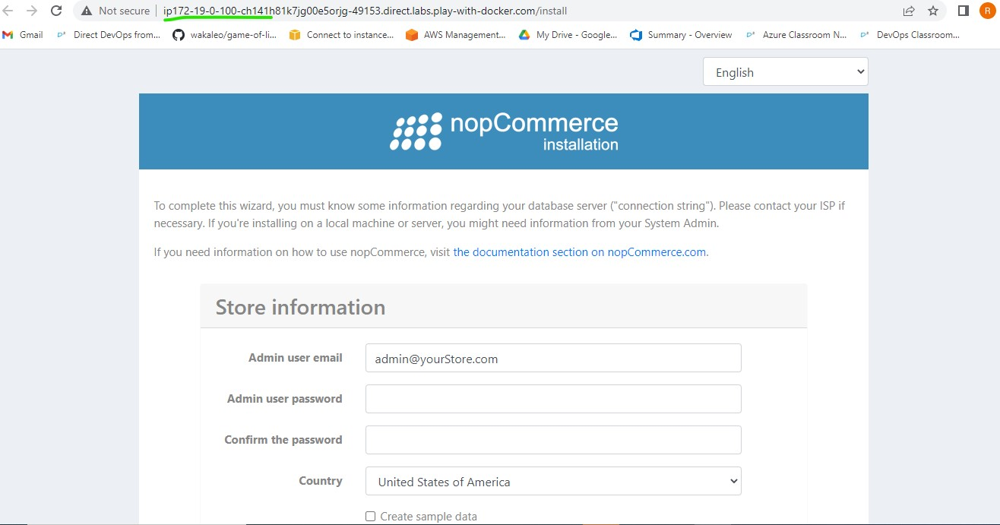

### Docker Practice 
* task 1 date 14.04.2023
* install docker usin linux vm
* login in terminal
* google docker install script
* using two commands 
* '''
* curl -fsSL https://get.docker.com -o get-docker.sh
# sh get-docker.sh
* '''
* do check docker --version
* docker info it shows no server
* we can add user 
* '''
* sudo usermod -aG docker 'username'
* '''
* 
* 
* check the docker images and also write down the size of hello-world
* 
* Run the nginx container with name as nginx and expose some port on docker host
* '''
* docker container run -d --name nginx1 -P nginx
* '''
* 
  

* explain docker container lifcycle
* ---------------------------------
* docker life cycle state
* created
* running
* paused
* stopped
* deleted
* 
* docker architecture

* DAY 2 Task
* ----------
*18.04.2023
----------
* ### create an alpine container in interactive mode and install python
* first login in vm and istall docker
* '''
*  <docker container run -it --name alpine alpine:latest>

* '''
  
* login to container and here install python using below steps
* -->apk --update upgrade
* --> apk add python3
* --> python3 --version
* .jpg)
* 
  * create Dockerfile --> vi Dockerfile
  '''
  * ---> IN Dockerfile
  FROM alpine:latest
  LABEL author="RUPA" organization="QT" 
  RUN apk --update upgrade
  RUN apk add python3
  CMD ["python3 --version"]
  '''
  * build the image --> ' docker image build -t "python" .'
  * 

* ### Create an ubuntu container with sleep 1d and then login using exec.install python

* first login in vm and istall docker
* '''
*  <docker container run -it --name ubuntu ubuntu:latest sleep id>
*  <docker container exec -it ubuntu /bin/bash >
* '''
* login to container and here install python using below steps
* '''
*  apt update && apt upgrade -y
*  apt install python3 -y
*  python3 --version
*  
* '''
* 
 
  * ## create a postgres container with user panaramic and password as trekking. try logging in and show the database {query for the psql}
  * first login in vm and istall docker
  * create database container <docker container run -it --name postdata -e POSTGRES_USER=panoramic -e  POSTGRES_PASSWORD=treakking -e  POSTGRES_DB=psql-P postgres
:15> 
* 
* Execute the container <docker container exec -it postdata /bin/bash>
* after login to the container using these command for write a table <psql -U panoramic -W trekking -d psql-P>
* 
* we can in to the psql-P here we are craeting table using these format
* '''
* CREATE TABLE Persons (
   PersonID int,
   Lastname varchar(255),
   Firstname varchar(255),
   Addressname varchar(255),
   Cityname varchar(255)
);
* '''
* fill in the values <insert into persons values (1 , 'vadranam', 'Rupa' , 'hyd' , 'gachibowli'),(2 , 'vadranam' , 'anand' , 'gachobowli' , 'hyd');>
* after using this <select * from Persons ;>
* 

## Try creating a dockerfile which runs phpinfo page, user ARG and ENV whereever appropriate
      * on apache server
      * on nginx server

* login docker play ground instance
* '''
* FROM ubuntu:20.04
LABEL author="Rupa" organization="QT" project="apache2"
 ARG DEBIAN_FRONTEND=noninteractive
 RUN apt update && apt install apache2 -y
 RUN apt install php libapache2-mod-php php -y && \
    echo "<? php phpinfo();?>" > /var/www/html/info.php
 EXPOSE 80
 CMD ["apache2ctl","-D", "FOREGROUND"]
* '''
* 
* create docker image <docker image build -t apache .>
* 
* create container <docker comtainer run -d --name php -P apache>
* 
* 
* 
* 
* 
* 
* 
## Create a Jenkins image by creating your own Dockerfile
* first login in vm and istall docker
* vi Docker file 
* '''
* FROM ubuntu:22.04
LABEL author="Rupa" organization="QT" project="jenkinsfile"
RUN apt update 
RUN apt install openjdk-11-jdk -y
RUN apt install curl -y
RUN curl -fsSL https://pkg.jenkins.io/debian/jenkins.io-2023.key | tee \
  /usr/share/keyrings/jenkins-keyring.asc > /dev/null
RUN echo deb [signed-by=/usr/share/keyrings/jenkins-keyring.asc] \
  https://pkg.jenkins.io/debian binary/ | tee \
  /etc/apt/sources.list.d/jenkins.list > /dev/null
RUN apt update && apt install jenkins -y  
EXPOSE 8080
CMD [ "/usr/bin/jenkins" ]
* '''
* 
* create image <docker image build -t ubuntu1 .>
* 
* create container < docker container run --name jenkins -d -P ubuntu1>
* 
* login to the mechine <docker container exec -it jenkins /bin/bash>
* 

## Create nop commererce and mysql server container and try to make them work by configuring

* create network with subnet
* <docker network create -d bridge --subnet "10.0.0.0/24" mysqlnetwork>
* 
* create volume 
* <docker volume create mysqlvolume>
* /
* Create SQL using volume & network 
* <docker container run -d --name mysqldb -v MYVOL:/var/libmysqlbd --network mysqlnetwork -e MYSQL_USER=rupa -e MYSQL_ROOT_PASSWORD=rupa@1234 -e MYSQL_DATABASE=employees mysql:8>
* 

* Dockerfile
* '''
* FROM mcr.microsoft.com/dotnet/sdk:7.0
LABEL author="rupa" organization="qt" project="learning"
ADD https://github.com/nopSolutions/nopCommerce/releases/download/release-4.60.2/nopCommerce_4.60.2_NoSource_linux_x64.zip /nop/nopCommerce_4.60.2_NoSource_linux_x64.zip
WORKDIR /nop
RUN apt update && apt install unzip -y && \
    unzip /nop/nopCommerce_4.60.2_NoSource_linux_x64.zip && \
    mkdir /nop/bin && mkdir /nop/logs
EXPOSE 5000
CMD [ "dotnet","Nop.Web.dll", "--urls", "http://0.0.0.0:5000" ]

* '''
* create docker image <docker image build -t nop:v1.0 .>
* Create docker container <docker container run --name mynop1 -d -P --network mysqlnetwork -e MYSQL_SERVER=mysqldb nop:v1.0>
* 
* we create nopecommerce container the mechine will be automaticaly down then go to terminal <docker container start "container id">
* 
* login page
* 

### 21/04/23
* task
* Create a multi-stage Dockerfile to build
*  a) nop ecommerce
*  b) springpetclinic
*  c) student code register
* # a) nop ecommerce
* '''
* FROM ubuntu:latest AS extractor
RUN apt update && apt install unzip -y
ARG DOWNLOAD_URL=https://github.com/nopSolutions/nopCommerce/releases/download/release-4.60.2/nopCommerce_4.60.2_NoSource_linux_x64.zip
ADD ${DOWNLOAD_URL} /nopCommerce/nopCommerce_4.60.2_NoSource_linux_x64.zip
RUN cd /nopCommerce && unzip nopCommerce_4.60.2_NoSource_linux_x64.zip && mkdir bin logs && rm nopCommerce_4.60.2_NoSource_linux_x64.zip

FROM mcr.microsoft.com/dotnet/sdk:7.0
LABEL author="rupa" organization="qt" project="learning"
ADD https://github.com/nopSolutions/nopCommerce/releases/download/release-4.60.2/nopCommerce_4.60.2_NoSource_linux_x64.zip /nop/nopCommerce_4.60.2_NoSource_linux_x64.zip
WORKDIR /nop
COPY --from=extractor /nopCommerce /nop
EXPOSE 5000
CMD [ "dotnet","Nop.Web.dll", "--urls", "http://0.0.0.0:5000" ]
* '''
* 
* Create image <docker image build -t nop .>
* create container <docker container run -d --name multinop -P nop:latest>
* 
* 

* PUSH the images
* steps:
* CLi intallation-->1)sudo apt update
*                   2)curl -sL https://aka.ms/InstallAzureCLIDeb | sudo bash
*                   3) az --version (check for version)
*                   4)az login
* then <docker login>
* 
* 
* 
*                   

* # spc
'''
FROM alpine/git AS vcs
RUN cd / && git clone https://github.com/spring-projects/spring-petclinic.git && \
    pwd && ls /spring-petclinic
FROM maven:3-amazoncorretto-17 AS builder
COPY --from=vcs /spring-petclinic /spring-petclinic
RUN ls /spring-petclinic
RUN cd /spring-petclinic && mvn package
FROM amazoncorretto:17-alpine-jdk
LABEL author="rupa" organization="qt" project="learning"
EXPOSE 8080
ARG HOME_DIR=/spc
WORKDIR ${HOME_DIR}
COPY --from=builder /spring-petclinic/target/spring-*.jar ${HOME_DIR}/spring-petclinic.jar
EXPOSE 8080
CMD ["java", "-jar", "spring-petclinic.jar"]
'''

* ## SRC

'''
FROM alpine/git AS vcs
RUN cd / && git clone https://github.com/DevProjectsForDevOps/StudentCoursesRestAPI.git && \
pwd && ls /StudentCoursesRestAPI
FROM python:3.8.3-alpine As Builder
LABEL author="rupa" organization="qt" project="learning"
COPY --from=vcs /StudentCoursesRestAPI /StudentCoursesRestAPI
ARG DIRECTORY=StudentCourses
RUN cd / StudentCoursesRestAPI cp requirements.txt /StudentCourses
ADD . ${DIRECTORY}
EXPOSE 8080
WORKDIR StudentCoursesRestAPI
RUN pip install --upgrade pip
RUN pip install -r requirements.txt
ENTRYPOINT ["python", "app.py"]
'''
* create docker image <docker image build -t src .>
* create contaainer <docker container run -d --name src -P src:latest>
* 
* 

* ## Docker compose file 
* NOP Commerce
* Write a docker file for Nop Commerce

* create image <docker image build -t nop .>

* Write a docker compose file for Nop Commerce

* vi docker-compose.yml/yaml

* '''
* ---
version: "3.9"
services:
  nop:
    build:
      context: .
      dockerfile: Dockerfile
    networks:
      - nop-net
    ports:
      - "32000:5000"
    depends_on:
      - nop-db

  nop-db:
    image: mysql:8
    networks:
      - nop-net
    volumes:
      - nop-db:/var/lib/mysql
    environment:
      - MYSQL_ROOT_PASSWORD=rupa@123
      - MYSQL_USER=nop
      - MYSQL_PASSWORD=rupa@123
      - MYSQL_DATABASE=nop
volumes:
  nop-db:
networks:
  nop-net:
* '''

* To run the docker compose command is <docker compose up -d>

* To check the docker container creation by using command
* 
* 